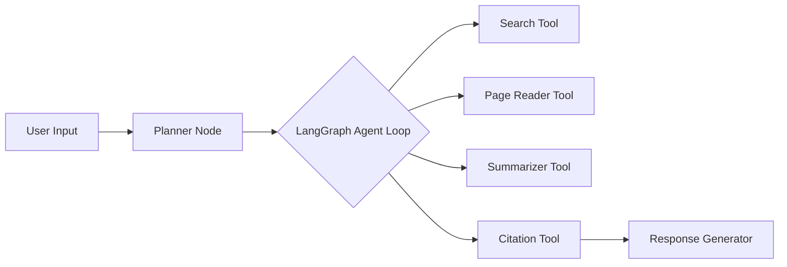

# 🧠 Research Assistant Agent

An autonomous, tool-using AI agent that helps you perform high-quality, citation-backed research by planning, searching, reading, and summarizing sources in a transparent and trustworthy way.

> 🔍 “Like a personal research intern powered by AI—searches, reads, reasons, and summarizes with live citations.”

---

## 🚀 Features

- 🧠 **Agentic AI architecture** using ReAct + Planning
- 🔧 **Tool-based intelligence** (search, read, summarize, cite)
- 📚 **Citation-first answers** with source links and summaries
- 🔁 **Autonomous multi-step reasoning**
- 🧱 **Modular + explainable workflow**
- 🧠 **Memory & context persistence**
- 💬 **Responsive chat interface (Next.js)**

---

## 🧩 Architecture



---

## ⚙️ Tech Stack

- **Frontend**: Next.js + TailwindCSS (Chat UI)
- **Agent Engine**: LangChain + LangGraph
- **LLM**: GPT-4, Claude, or any OpenAI-compatible model
- **Tools**:
  - Web search (Serper.dev or Tavily)
  - Web/page scraper
  - Summarizer
  - Citation metadata extractor
- **Memory**: Supabase vector store or LangChain memory
- **Hosting**: Vercel + serverless API (Node)

---

## 📁 Project Structure

```
research-agent/
├── frontend/          # Next.js frontend
├── agent-core/        # Agent logic (LangChain, tools, graph)
│   ├── tools/         # Search, scrape, summarize, cite
│   ├── memory/        # Memory/DB setup
│   └── planner.ts     # Planning logic
├── api/               # API routes (agent invoker)
└── config/            # .env, constants
```

---

## 🛠️ Getting Started

### 1. Clone the Repo

```bash
git clone https://github.com/yourname/research-agent.git
cd research-agent
```

### 2. Install Dependencies

```bash
pnpm install
```

### 3. Configure `.env`

```env
OPENAI_API_KEY=your-openai-key
SERPER_API_KEY=your-serper-key
SUPABASE_URL=your-supabase-url
SUPABASE_KEY=your-supabase-key
```

### 4. Run the App

```bash
pnpm dev
```

---

## 🧪 Example Query

> “What are the newest breakthroughs in cancer immunotherapy research?”

**Agent Output:**
- Summary of 3 peer-reviewed articles
- Citation links with metadata
- Step-by-step log of reasoning and tool usage

---

## 🧠 Concepts Implemented

| Concept | Description |
|--------|-------------|
| ReAct | Reasoning + Action loop |
| Tool Use | Search, Read, Summarize, Cite |
| Memory | Vector-based long-term memory |
| Planning | Subgoal breakdown |
| LangGraph | Multi-node autonomous agent loop |
| Explainability | Each step + output is visible |

---

## 🧱 Roadmap

- [ ] PDF document upload support
- [ ] Multimodal summarization (images, charts)
- [ ] Citation style configuration (APA, MLA)
- [ ] User accounts + query history
- [ ] Multi-agent collaboration (critic, reviewer)

---

## 🤝 Contributing

We welcome feature ideas, PRs, and tool contributions. Please create issues for bugs or ideas.

---

## 📄 License

MIT © 2025 [Your Name]
