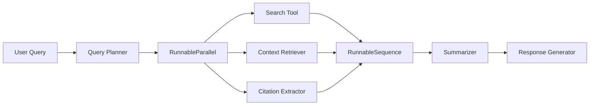

# 🔗 LangChain RunnableSequence & LCEL Integration Guide

*For Research Assistant Agent Project*

---

## 🎯 What is RunnableSequence?

**RunnableSequence** is a core composition primitive in LangChain's Expression Language (LCEL) that allows you to **chain multiple runnables sequentially**, where the output of one runnable becomes the input of the next.

### **Basic Concept**
```typescript
// Traditional approach
const output1 = await runnable1.invoke(input);
const output2 = await runnable2.invoke(output1);
const finalOutput = await runnable3.invoke(output2);

// LCEL RunnableSequence approach
const chain = runnable1.pipe(runnable2).pipe(runnable3);
const finalOutput = await chain.invoke(input);
```

---

## 🧩 LCEL Fundamentals

### **What is LCEL?**
**LangChain Expression Language (LCEL)** is the modern, declarative approach to building chains in LangChain, replacing legacy classes like `LLMChain`.

### **Key Benefits**
- ✅ **Optimized parallel execution** - runs components concurrently when possible
- ✅ **Guaranteed async support** - all chains can run asynchronously
- ✅ **Simplified streaming** - incremental output as chains execute
- ✅ **Automatic LangSmith tracing** - full observability out of the box
- ✅ **Standard API** - consistent interface across all runnables

### **Core Composition Primitives**

#### **1. RunnableSequence (Sequential)**
```typescript
import { RunnableSequence } from "@langchain/core/runnables";

// Explicit creation
const chain = RunnableSequence.from([runnable1, runnable2, runnable3]);

// Using pipe method (preferred)
const chain = runnable1.pipe(runnable2).pipe(runnable3);
```

#### **2. RunnableParallel (Concurrent)**
```typescript
import { RunnableParallel, RunnablePassthrough } from "@langchain/core/runnables";

// Run multiple operations concurrently
const chain = RunnableParallel.from({
    search_results: searchTool,
    user_query: new RunnablePassthrough(),
    context: retriever
});
```

---

## 🏗️ Integration in Research Assistant Agent

### **Current Architecture Vision**
Based on your README, here's how RunnableSequence will power your agent:



### **Implementation Examples**

#### **1. Basic Research Chain**
```typescript
import { RunnableSequence } from "@langchain/core/runnables";
import { ChatPromptTemplate } from "@langchain/core/prompts";
import { StringOutputParser } from "@langchain/core/output_parsers";
import { ChatOpenAI } from "@langchain/openai";

// Components
const queryPlanner = ChatPromptTemplate.fromTemplate(
    "Plan research steps for: {query}"
);
const searchTool = new SerperSearchTool();
const summarizer = ChatPromptTemplate.fromTemplate(
    "Summarize this research: {search_results}"
);
const llm = new ChatOpenAI();
const parser = new StringOutputParser();

// Sequential chain
const researchChain = queryPlanner
    .pipe(llm)                    // Generate search strategy
    .pipe(searchTool)             // Execute search
    .pipe(summarizer)             // Create summary prompt
    .pipe(llm)                    // Generate summary
    .pipe(parser);                // Parse to string

// Usage
const result = await researchChain.invoke({ query: "latest AI developments" });
```

#### **2. Advanced Multi-Tool Chain**
```typescript
import { RunnableParallel, RunnablePassthrough } from "@langchain/core/runnables";

// Parallel information gathering
const infoGathering = RunnableParallel.from({
    web_search: searchTool,
    knowledge_base: vectorRetriever,
    original_query: new RunnablePassthrough(),
});

// Sequential processing with parallel input
const fullResearchChain = infoGathering
    .pipe(citationExtractor)     // Extract citations
    .pipe(contentSynthesizer)    // Synthesize information
    .pipe(responseFormatter);    // Format final response
```

#### **3. Tool-Calling Research Agent**
```typescript
import { RunnableLambda } from "@langchain/core/runnables";

const routeQuery = RunnableLambda.from(async (queryData: { query: string }) => {
    // Route to appropriate research strategy
    if (queryData.query.toLowerCase().includes("recent")) {
        return webSearchChain;
    } else if (queryData.query.toLowerCase().includes("academic")) {
        return academicSearchChain;
    } else {
        return generalResearchChain;
    }
});

// Dynamic routing chain
const agentChain = routeQuery.pipe(
    RunnableLambda.from(async (chain) => chain) // Execute selected chain
);
```

---

## 🔄 Agent Workflow Implementation

### **Complete Research Assistant Chain**

```typescript
import {
    RunnableSequence, 
    RunnableParallel, 
    RunnablePassthrough,
    RunnableLambda
} from "@langchain/core/runnables";
import { ChatPromptTemplate } from "@langchain/core/prompts";
import { StringOutputParser } from "@langchain/core/output_parsers";

// Step 1: Query Planning
const queryAnalysis = ChatPromptTemplate.fromTemplate(`
    Analyze this research query and identify:
    1. Key topics to search
    2. Required information types
    3. Potential sources
    
    Query: {user_query}
`);

// Step 2: Parallel Information Gathering
const researchGathering = RunnableParallel.from({
    web_results: serperSearchTool,
    knowledge_base: vectorRetriever, 
    query_context: new RunnablePassthrough(),
});

// Step 3: Content Processing
const contentProcessor = RunnableSequence.from([
    webpageScraper,        // Scrape full content
    contentChunker,        // Break into chunks
    relevanceFilter,       // Filter relevant chunks
]);

// Step 4: Citation & Summary
const synthesisChain = RunnableParallel.from({
    citations: citationExtractor,
    summary: contentSummarizer,
    sources: sourceValidator,
});

// Step 5: Response Generation
const responseGenerator = ChatPromptTemplate.fromTemplate(`
    Generate a comprehensive research response using:
    
    Citations: {citations}
    Summary: {summary}
    Sources: {sources}
    
    Format with proper citations and source links.
`);

// Complete Agent Chain
const researchAgent = queryAnalysis
    .pipe(llm)                   // Generate research plan
    .pipe(researchGathering)     // Gather information in parallel
    .pipe(contentProcessor)      // Process raw content
    .pipe(synthesisChain)        // Extract citations & summarize
    .pipe(responseGenerator)     // Generate final response
    .pipe(llm)                   // Create final output
    .pipe(new StringOutputParser()); // Parse to string
```

---

## 🎨 Advanced LCEL Patterns for Your Agent

### **1. Conditional Routing**
```typescript
const routeByComplexity = RunnableLambda.from(async (queryData: { query: string }) => {
    if (queryData.query.length > 100) {
        return complexResearchChain;
    } else {
        return simpleResearchChain;
    }
});
```

### **2. Error Handling & Fallbacks**
```typescript
// Primary search with fallbacks
const searchWithFallbacks = primarySearchTool.withFallbacks([
    backupSearchTool,
    cachedSearchResults
]);
```

### **3. Streaming Support**
```typescript
// Enable streaming for real-time responses
async function* streamResearch(userQuery: string) {
    for await (const chunk of researchAgent.stream(userQuery)) {
        yield chunk;
    }
}
```

### **4. Memory Integration**
```typescript
import { RunnablePassthrough } from "@langchain/core/runnables";

// Add conversation memory
const memoryChain = RunnablePassthrough.assign({
    chat_history: RunnableLambda.from(async (x: any) => 
        getConversationHistory(x.session_id)
    )
});

const agentWithMemory = memoryChain.pipe(researchAgent);
```

---

## 🔧 Practical Implementation Steps

### **Phase 1: Basic Chain**
```typescript
// Start simple
const basicChain = prompt.pipe(llm).pipe(outputParser);
```

### **Phase 2: Add Tools**
```typescript
// Add search capability
const searchChain = prompt
    .pipe(llm)
    .pipe(searchTool)
    .pipe(summarizer)
    .pipe(llm)
    .pipe(parser);
```

### **Phase 3: Parallel Processing**
```typescript
// Multiple data sources
const parallelChain = RunnableParallel.from({
    search: searchTool,
    context: retriever
}).pipe(synthesisTool);
```

### **Phase 4: Full Agent**
```typescript
// Complete research assistant
const fullAgent = queryAnalyzer
    .pipe(researchPlanner)
    .pipe(RunnableParallel.from({
        web: webSearch,
        papers: academicSearch,
        kb: knowledgeBase
    }))
    .pipe(contentProcessor)
    .pipe(citationGenerator)
    .pipe(responseFormatter);
```

---

## 🚀 Benefits for Your Research Agent

### **1. Modularity**
- Each step is independently testable
- Easy to swap components (different search APIs, LLMs)
- Clear separation of concerns

### **2. Performance**
- Automatic parallelization where possible
- Streaming support for real-time responses
- Optimized execution paths

### **3. Observability**
- Automatic tracing with LangSmith
- Easy debugging of chain execution
- Performance monitoring built-in

### **4. Scalability**
- Async support for high concurrency
- Easy horizontal scaling
- Resource optimization

---

## 📝 Next Steps for Implementation

### **Immediate (Week 1)**
1. Set up basic `prompt.pipe(llm).pipe(parser)` chain
2. Add simple web search tool
3. Test with example queries

### **Short-term (Week 2-3)**
1. Implement `RunnableParallel` for multiple searches
2. Add citation extraction
3. Create response formatting

### **Medium-term (Week 4-6)**
1. Add vector database integration
2. Implement conversation memory
3. Build streaming interface

### **Long-term (Week 7+)**
1. Advanced routing and planning
2. Multi-modal support
3. Comprehensive error handling

---

## 🎯 Key Takeaways

1. **RunnableSequence** is the backbone of modern LangChain applications
2. **LCEL** provides superior performance and observability vs. legacy chains
3. Your **Research Assistant Agent** will benefit from:
   - Parallel information gathering
   - Sequential processing pipeline
   - Automatic optimization and tracing
   - Easy component swapping and testing

4. Start simple with basic chains, then add complexity incrementally
5. Use `RunnableParallel` for concurrent operations (searches, retrievals)
6. Use `.pipe()` method for step-by-step processing (plan → search → summarize → respond)

---

*This guide serves as your reference for implementing LCEL patterns in the Research Assistant Agent project.* 